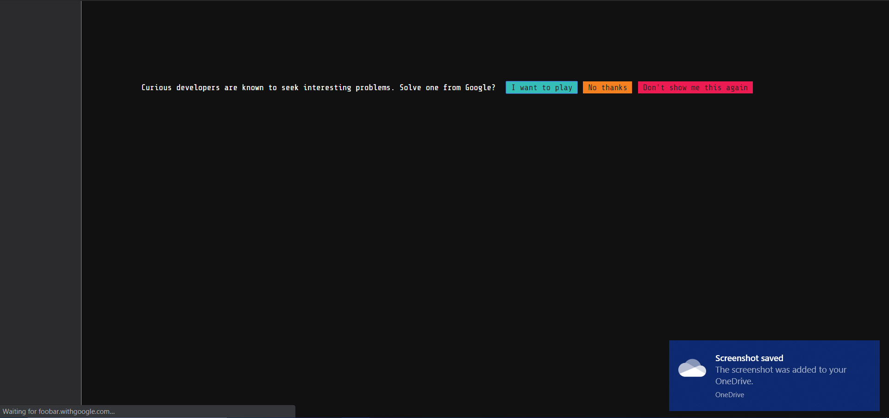
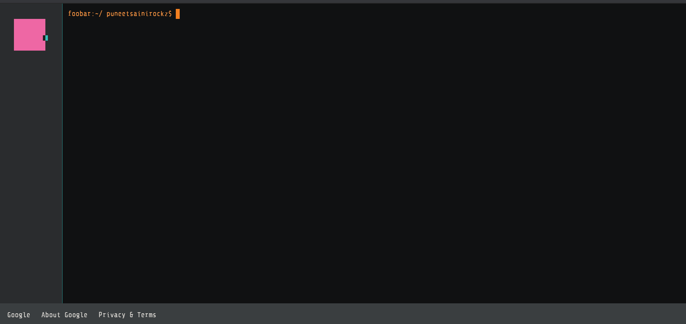

# Solutions to Google FooBar problems

So I got an invitation to be a part of FooBar Challenge, the day I got rejected from Google's Summer of Code.

So, I was naturally pissed at myself. I opened Leetcode and started practicing DSA. While I was searching something about RedBlack Trees. I came across the invitation. Here's how the terminal looks! ❤

PS: I didn't intend to use that Google ID of mine. It is for personal stuff only. 😂 Can't complain though.

I'll be adding the solutions to each level once I have cleared all 5.

## Problems

Level | Status | Languages
------------ | ------------- | -------------
[Level 1](Level1.py) | Cleared! | Python
[Level 2](Level2.py) | Not Requested | Python
[Level 3](Level3.py) | Not Requested | Python
[Level 4](Level4.py) | Not Requested | Python
[Level 5](Level5.py) | Not Requested | Python
