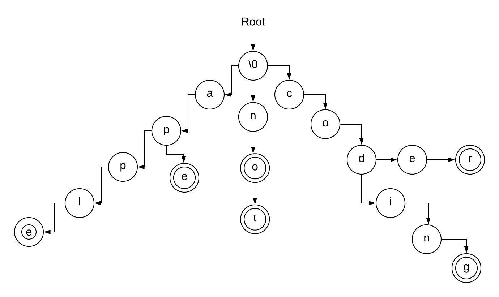

# Algorithms and Data Structures

Implementation of algorithms and data structures from various programming portals (CodeChef, HackerEarth, HackerRank, Spoj, Topcoder, etc.).

## Problems

Name | Status | Tags | Languages
------------ | ------------- | ------------- | -------------
[ACODE](ACODE.py) | :heavy_check_mark: | `#dynamic-programming` | Python
[ACPC10A](ACPC10A.py) | :heavy_check_mark: | *no tags* | Python
[ADDREV](ADDREV.py) | :heavy_check_mark: | `#simple-math` `#ad-hoc-1` | Python
[AE00](AE00.py) | :heavy_check_mark: | `#ad-hoc-1` | Python
[AGGRCOW](AGGRCOW.py) | :heavy_check_mark: | `#binary-search` | Python
[AIBOHP](AIBOHP.cpp) | :heavy_check_mark: | `#dynamic-programming` | [Python](AIBOHP.py), [C++](AIBOHP.cpp)
[ARRAYSUB](ARRAYSUB.cpp) | :heavy_check_mark: | `#datastructures` `#sliding window` `#deque` | C++
[Big Integer Factorial](BigIntFactorial.cpp) | :heavy_check_mark: | `#mathematics` `#big-integers` | C++
[Binary Search](BinarySearch.cpp) | :heavy_check_mark: | `#array` `#searching` `#divide-and-conquer` | Python
[Birthday Paradox](BirthdayParadox.cpp) | :heavy_check_mark: | `#mathematics` | C++
[BYTESM2](BYTESM2.cpp) | :heavy_check_mark: | `#dynamic-programming` | [Python](BYTESM2.py), [C++](BYTESM2.cpp)
[CANDY](CANDY.py) | :heavy_check_mark: | `#ad-hoc-1` | Python
[Catalan Series](catalan.py) | :heavy_check_mark: | `#series` `#sequence` | C++
[COINS](COINS.py) | :heavy_check_mark: | `#dynamic-programming` | Python
[DoorStatus](DoorStatus.py) | :heavy_check_mark: | `#TCS` `#mathematics` | Python
[DOUGHNUT](DOUGHNUT.py) | :heavy_check_mark: | *no tags* | Python
[FASHION](FASHION.py) | :heavy_check_mark: | `#ad-hoc-1` | Python
[FCTRL](FCTRL.py) | :heavy_check_mark: | `#math` | Python
[FCTRL2](FCTRL2.py) | :heavy_check_mark: | `#math` `#big-numbers` | Python
[German Lotto](GermanLotto.cpp) | :dove: | `#ad-hoc` `#mathematics` `#brute-force` `#complete-search` | C++
[NSTEPS](NSTEPS.py) | :heavy_check_mark: | `#ad-hoc-1` | Python
[ONP](ONP.py) | :heavy_check_mark: | `#stack` | Python
[PRIME1](PRIME1.py) | :rocket: | `#number-theory` | Python
[SAMER08F](SAMER08F.cpp) | :heavy_check_mark: | *no tags* | [Python](SAMER08F.py), [C++](SAMER08F.cpp)
[SEQ](SEQ.cpp) | :heavy_check_mark: | `#transformation-matrix` `#recursive` `#series` | C++
[Sort Game](SortGame.cpp) | :heavy_check_mark: | `#sorting` `#vectors` `#pairs` | C++
[TEST](TEST.py) | :heavy_check_mark: | `#basic` `#tutorial` `#ad-hoc-1` | Python
[TOANDFRO](TOANDFRO.py) | :heavy_check_mark: | `#ad-hoc-1` | Python

Labels:

* :heavy_check_mark: : Done
* :dove: : Incomplete
* :rocket: : Needs optimization

## Data Structures

* ### TRIE

1. It is an information retrieval data structure.
2. It is also called radix/prefix tree.
3. It is used for efficient searching of keys in a container. If the keys are strings, the particular string can be searched in O(n), where n denotes the length of the string to be searched.
4. Each node of the trie has multiple branches, a node where a word ends is marked with terminal = true.

Implementation : [trie](DataStructures/trie.cpp)

## Series

### Catalan Series

#### Formula

1. Number of possible binary search trees with n keys.
2. Number of expressions containing n pairs of parantheses which are correctly matched. For n = 3, possible expressions are ((())), ()()(), (())(), ()(()), (()())
3. Number of ways n + 1 factors can be completely paranthesized, for eg. N = 3 and 3 + 1 factors: (a, b, c, d), we have: (ab)(cd), a(b(cd)), ((ab)c)d, (a(bc))d, a((bc)d).
4. Number of ways a convex polygon of n + 2 sides can split into triangles by connecting vertices.
5. Number of different unlabelled binary trees can be there with n nodes.
6. The number of paths with 2n steps on a rectangular grid from botton left, i.e., (n-1, 0) to top right (0, n-1) that do not cross above the main diagonal.
7. Number of ways to form a "mountain range"  with n upstrokes and n downstrokes.
